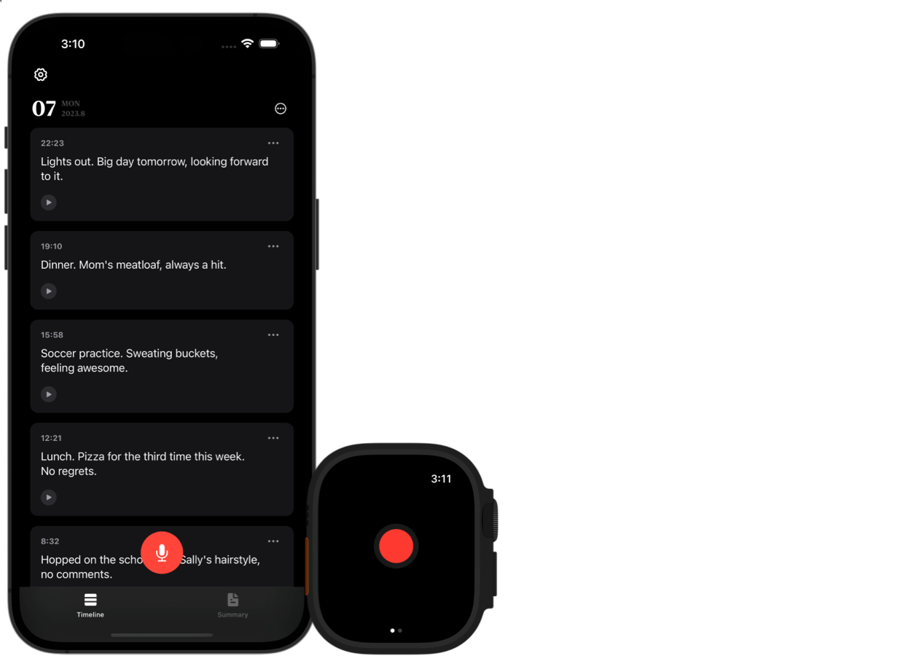

# ALog



## Installation

[](https://apps.apple.com/us/app/alog/id6451082482)

## Building the project

Follow these steps to build the project:

#### 1. Clone the repo

#### 2. Install xcodegen

```shell
brew install xcodegen
```

#### 3. Install Ruby gems

```shell
bundle install
```

#### 4. Copy .env.example to .env

To setup up the environment variables, copy the `.env.example` file and rename it as `.env`.

```shell
cp .env.example .env
```

#### 5. Generate the Arkana package

```shell
bin/arkana
```

#### 6. Generate the project

Finally, generate the project by running:

```shell
xcodegen
```

Once you've followed these steps, you should have a fully built project ready for development. If you encounter any issues, please open an issue in the repository.

## License

Distributed under the GNU General Public License v2.0. See [LICENSE](./LICENSE) for more information.

**Important Note:** This open-source license does not prevent anyone from renaming and repackaging this app for distribution. However, doing so is in direct violation of App Store Review Guidelines, specifically Guideline 4.1 (Copycats) and Guideline 4.3 (Spam). Any attempt to simply rename and repackage this app for submission to the App Store is explicitly prohibited.

## Credits

Thanks to [@onenewbite](https://twitter.com/onenewbite) for his inspiring video "[为什么你应该开始用ChatGPT写日记|做笔记](https://www.youtube.com/watch?v=ZRv0Z-M7NqM)", which has greatly influenced this project.
